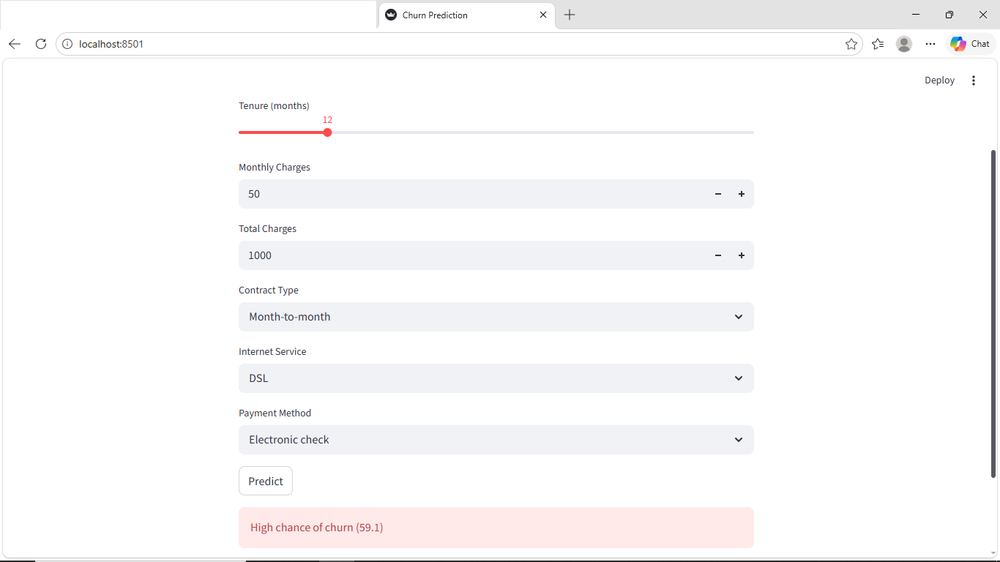

# Customer Churn Prediction (Deployed App)



This project predicts whether a telecom customer is likely to churn based on basic account and service details.

The model is trained on customer data and then deployed as a simple web application using Streamlit.

---

## What This Project Does

* Takes user input such as tenure, charges, contract type, etc.
* Applies the same preprocessing used during model training
* Uses a trained XGBoost model to generate churn probability
* Displays whether the customer is likely to churn

---

## Files in This Project

* `app.py` → Streamlit application
* `churn_model.pkl` → trained model
* `scaler.pkl` → scaling object
* `model_columns.pkl` → feature structure used during training

---

## How to Run

1. Install dependencies:

```
pip install -r requirements.txt
```

2. Run the app:

```
streamlit run app.py
```

3. Open in browser:

```
http://localhost:8501
```

---

## Key Points

* Model trained using telecom churn dataset
* Includes preprocessing (encoding + scaling)
* Ensures same feature structure during prediction
* Simple UI for testing predictions

---

## Note

This is a local deployment using Streamlit. It can be extended further using APIs or cloud deployment.
